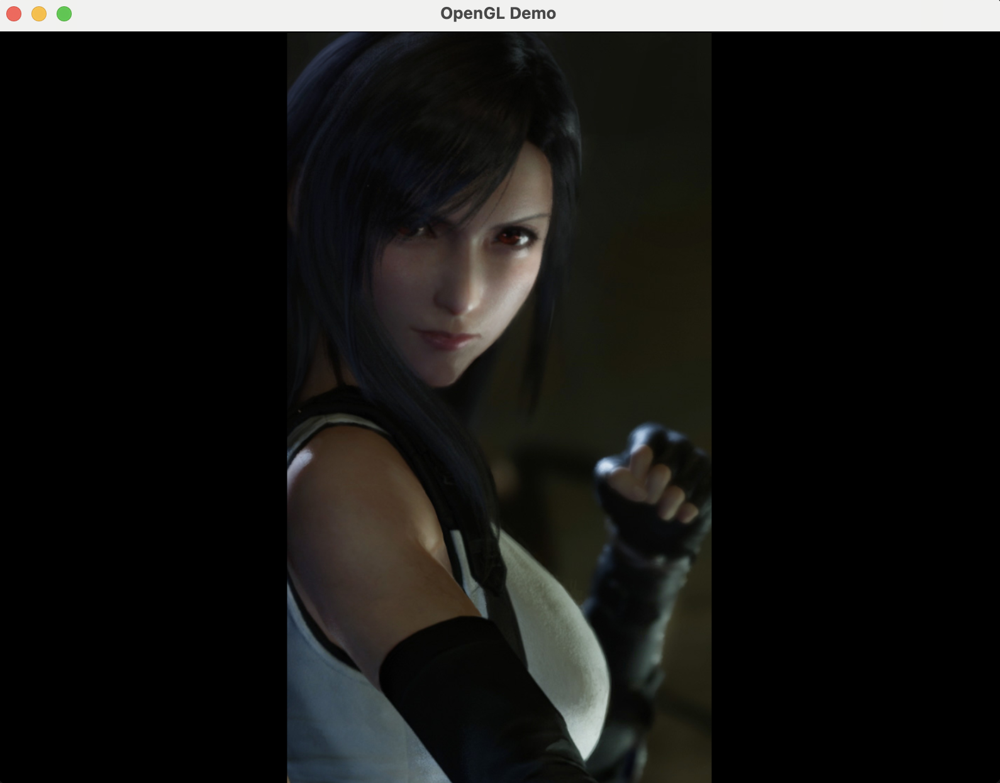
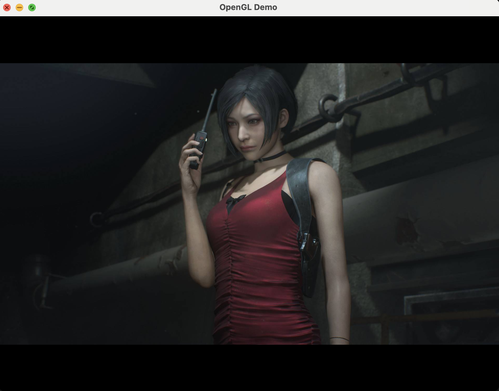

# Framer
Framer is a utility class in C++ that allow you to put a *picture* into a *frame* without distortion, such as putting a 3:4 image into a 9:16 container.


Putting 540p image into a 800x600 container with aspect fit mode.


Putting 1080p image into a 800x600 container with aspect fit mode.


usage
```c++
#include "Framer.hpp"
...

using namespace WDFramer;
Framer framer{
    {540, 960}, //<-- image size
    {800, 600}, //<-- container size
    origin_t::bottom_left, //<-- choose origin style
    mode_t::aspectFit //<-- choose content mode
};

//convert point from picture's coordinate system into the container's
auto p = framer.pic2Frame(pic_point);

//convert the another way around
auto q = framer.frame2Pic(pic_point);

//generate the opengl vertex and texture coordinate data
//the vertex position will fill the entire NDC, the texture
//coordinates will be adjusted.
float verts[8], tex[8];
framer.gl_fullscreen_quad(verts, tex);

//the texture coordinate will fill the entire quad
//the vertices will be adjust accordingly.
framer.gl_dynamic_quad(verts, tex);
```